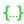

  <h1>
    
    
  </h1>
  

    Stateful & programmable mock server
  

# Introduction

[![Buy Me A Coffee][bmc-shield-src]][bmc-href]

<!-- Badges -->

[bmc-src]: https://bmc-cdn.nyc3.digitaloceanspaces.com/BMC-button-images/custom_images/orange_img.png
[bmc-href]: https://www.buymeacoffee.com/drosse
[bmc-shield-src]: https://img.shields.io/static/v1?message=Buy%20me%20a%20coffee&logo=buy-me-a-coffee&style=flat-square&label=Sponsor&logoColor=white&color=ff813f

**Drosse is a stateful and programmable mock server written in javascript.**

Based on [h3](https://h3.unjs.io/), Drosse uses [loki](https://github.com/techfort/LokiJS)
to store your mock data in memory so you can modify them in your
`POST`, `PUT`, `PATCH` and `DELETE` requests.

It comes out of the box with all the features you need to completely simulate a backend API,
making it the best companion for any frontend developer 🤓

## Features

-  **Tight to your project**
 
<small>
Your mocks and your mock-server are part of your project.
You can run as many drosse instances as you want simultaneously.
</small>

-  **Easy configuration**
 
<small>
Configuring drosse is as simple as writing its port number in a `.drosserc.js`
file and writing route definitions in a `routes.json` file.
</small>

-  **Cascading configs**
 
<small>
Routes are defined as a JSON tree of sub-paths - plugins (throttle, proxy, ...)
are inherited by child routes.
</small>

-  **Static mocks**
 
<small>
Write mocks directly in the `routes.json` file (inline mode) or in JSON files
(static mode).
</small>

-  **Dynamic mocks**
 
<small>
Build dynamic responses in javascript and access to the persisted data api,
request and response objects and the NodeJS environment.
</small>

-  **Assets handling**
 
<small>
Serve multimedia files with patterns and wild cards for easy fallback.
</small>

-  **Dynamic URL params**
 
<small>
Match any route/endpoint pattern with dynamic parameters (e.g. `/api/users/:id`).
</small>

-  **Data persistence**
 
<small>
Work with stateful and interactive mocks thanks to the in-memory JSON database
accessible via an easy-to-use API.
</small>

-  **Throttling**
 
<small>
Delay response time of your routes, even the proxied ones.
</small>

-  **Proxying**
 
<small>
Super-flexible proxy mechanism with inheritance and overwriting of sub-routes
(with different proxy or local route).
</small>

-  **Middlewares**
 
<small>
Extend Drosse with custom express middlewares to fulfill your use cases
(user session, websocket, jwt, ...).
</small>

-  **Templates**
 
<small>
Uuse response templates to avoid repeating yourself.
</small>

-  **Scraping**
 
<small>
Scrape proxied endpoints and save the content to Drosse's database or
static files.
</small>

-  **Extensible REPL CLI**
 
<small>
Build custom commands and execute them at runtime => simulate interaction
with 3rp-party services.
</small>

## Examples

Find example code in the [examples](https://github.com/jota-one/drosse/tree/master/examples) folder.

## Contact & Support

- Create a [GitHub issue](https://github.com/jota-one/drosse/issues) for bug reports, feature requests, or questions
- Add a ⭐️ [star on GitHub](https://github.com/jota-one/drosse) or ☕️ [buy us a coffe](https://www.buymeacoffee.com/drosse) to support the project!

## Credits & License

**Drosse** is crafted by [Jota](https://jota.one) and licensed under the [MIT license](https://github.com/jota-one/drosse/blob/master/LICENSE).
